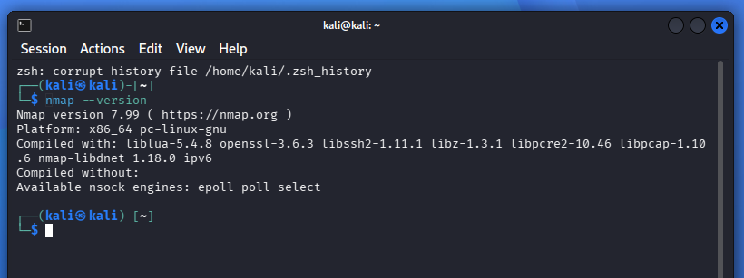
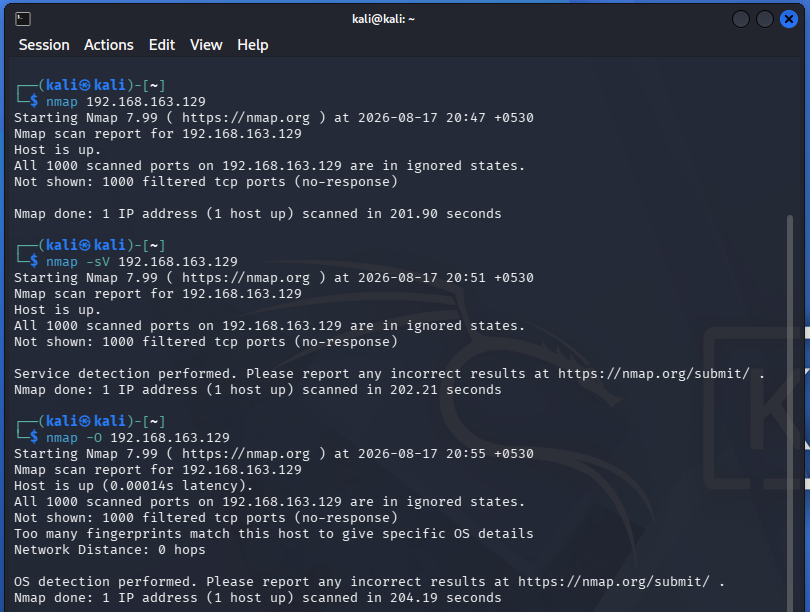
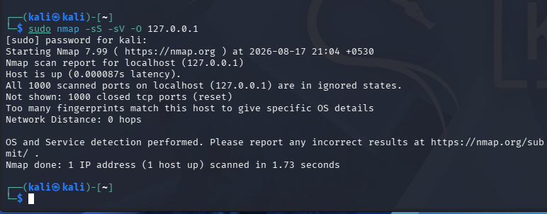

# Nmap Network Scanning Report

## 1. Introduction

This task was completed as part of my Oasis Infobyte Cyber Security Internship. The purpose of this task was to understand basic network scanning using Nmap and identify the ports, services, and operating system information available on a local system.

All scanning was performed in my own Kali Linux environment for educational purposes.

---

## 2. Objective

The main objectives of this task were:

- Install and verify Nmap.
- Perform a basic network scan.
- Identify open ports on the target system.
- Perform service and version detection.
- Perform operating system detection.
- Analyse the security implications of the discovered services.
- Document the scan results and recommendations.

---

## 3. Environment Used

- **Operating System:** Kali Linux
- **Tool:** Nmap
- **Terminal:** Kali Linux Terminal
- **Target:** Local system / authorised test machine
- **Scan Type:** Basic scan, service/version scan, and OS detection

---

## 4. Nmap Installation and Verification

Nmap was already available on my Kali Linux system.

I verified the installation using:

```bash
nmap --version
```

The command displayed the installed Nmap version and confirmed that Nmap was ready to use.

### Observation

The Nmap version information was displayed successfully, confirming that the tool was installed and working correctly.

### Analysis

Verifying the installation before performing scans helps ensure that the required scanning tool is available and functioning correctly.

---

## 5. What is Nmap?

Nmap, short for Network Mapper, is an open-source tool used for network discovery and security auditing. It can identify hosts, open ports, services, application versions, and operating system information.

Nmap is commonly used by security professionals and network administrators for network inventory, troubleshooting, security assessments, and service monitoring. :contentReference[oaicite:2]{index=2}

---

## 6. Why Network Scanning Matters

Network scanning helps administrators understand what systems and services are exposed on a network.

It can help identify:

- Open ports
- Running services
- Application versions
- Operating system information
- Unnecessary services
- Potential areas of security exposure

Knowing which services are accessible allows administrators to review whether those services are actually required and whether they are properly secured.

---

## 7. Scanning Methodology

The scanning was performed in three main stages.

### 7.1 Basic Scan

The basic Nmap scan was performed using:

```bash
nmap [TARGET_IP]
```

### Observation

The scan identified the target host and displayed the ports that were open or accessible.

### Analysis

The basic scan provided an initial view of the network exposure of the target system. It helped identify which ports required further investigation.

---

### 7.2 Service and Version Scan

The service/version scan was performed using:

```bash
nmap -sV [TARGET_IP]
```

### Observation

The scan provided additional information about the services running on the discovered open ports.

### Analysis

The `-sV` option allows Nmap to probe open ports and determine the service and, where possible, the application version. This information is useful when assessing whether a service may be outdated or unnecessarily exposed. :contentReference[oaicite:3]{index=3}

---

### 7.3 OS Detection

The operating system detection scan was performed using:

```bash
nmap -O [TARGET_IP]
```

### Observation

Nmap attempted to identify the operating system and device information based on the target's network responses.

### Analysis

The `-O` option enables Nmap's operating system detection capability. OS detection can provide useful information for understanding the type of system being assessed, although results can sometimes be approximate depending on the available network responses. :contentReference[oaicite:4]{index=4}

---

## 8. Scan Results

The scans identified the following open ports/services on the target:

| Port | Protocol | Service | Version |
|---|---|---|---|
| [PORT] | [TCP/UDP] | [SERVICE] | [VERSION] |
| [PORT] | [TCP/UDP] | [SERVICE] | [VERSION] |
| [PORT] | [TCP/UDP] | [SERVICE] | [VERSION] |

### Overall Observation

The Nmap scans provided information about the network services exposed by the target system. The basic scan identified accessible ports, while the service/version scan provided more details about the applications running on those ports.

---

## 9. Open Port / Security Analysis

### Port [PORT] – [SERVICE]

**Purpose:**

[Explain what this service normally does.]

**Security Risk:**

[Explain whether the service could create a security risk if unnecessarily exposed, outdated, or poorly configured.]

**Recommendation:**

[State whether the service should remain open, be restricted, or be updated.]

---

### Port [PORT] – [SERVICE]

**Purpose:**

[Explain what this service normally does.]

**Security Risk:**

[Explain the possible security concern.]

**Recommendation:**

[State the recommended security measure.]

---

### Port [PORT] – [SERVICE]

**Purpose:**

[Explain what this service normally does.]

**Security Risk:**

[Explain the possible security concern.]

**Recommendation:**

[State the recommended security measure.]

---

## 10. Security Observations

The scan results show that network exposure should be reviewed regularly.

An open port is not automatically a vulnerability. However, every accessible service increases the number of services that need to be maintained and secured.

Service and version information is particularly useful because outdated software may contain known vulnerabilities. Nmap's version detection is designed to identify the application and version where possible. :contentReference[oaicite:5]{index=5}

The following points should therefore be considered:

- Unnecessary services should be disabled.
- Required services should be kept updated.
- Access to administrative services should be restricted.
- Firewall rules should limit unnecessary network exposure.
- Service configurations should be reviewed regularly.

---

## 11. Recommendations

Based on the scanning activity, the following recommendations can be followed:

1. Disable services that are not required.
2. Keep all exposed services and applications updated.
3. Use firewall rules to restrict unnecessary access.
4. Restrict administrative services to trusted networks where possible.
5. Monitor open ports and services periodically.
6. Review service configurations for weak or unnecessary settings.
7. Perform regular vulnerability assessments on authorised systems.

---

## 12. Screenshots

The following screenshots were captured during the Nmap scanning process.

### Nmap Version

This screenshot shows the Nmap installation/version verification.



### Nmap Scan Results

This screenshot shows the basic, service/version, and OS detection scan results.



### Localhost Scan Result

This screenshot shows the detailed Nmap scan performed against the local system.



---

## 13. Ethical Considerations

All Nmap scans were performed only against my own local or authorised test environment.

No external websites, public servers, or unauthorised systems were scanned.

Network scanning should always be performed only when the tester owns the system or has explicit permission from the system owner.

---

## 14. Conclusion

This task provided practical experience with Nmap and basic network reconnaissance.

I learned how to perform a basic port scan, identify services and application versions, and attempt operating system detection. The results helped me understand how exposed network services can be identified and why unnecessary services should be reviewed and secured.

The task also showed me that network scanning is an important part of security assessment because it provides an initial view of the services exposed by a system.

Overall, this exercise improved my understanding of Nmap, network enumeration, service identification, and basic security analysis.

---

## 15. References

1. Nmap Official Documentation  
   https://nmap.org/docs.html

2. Nmap Reference Guide  
   https://nmap.org/book/man.html

3. Nmap Service and Version Detection Documentation  
   https://nmap.org/book/man-version-detection.html

4. Nmap OS Detection Documentation  
   https://nmap.org/book/osdetect.html
